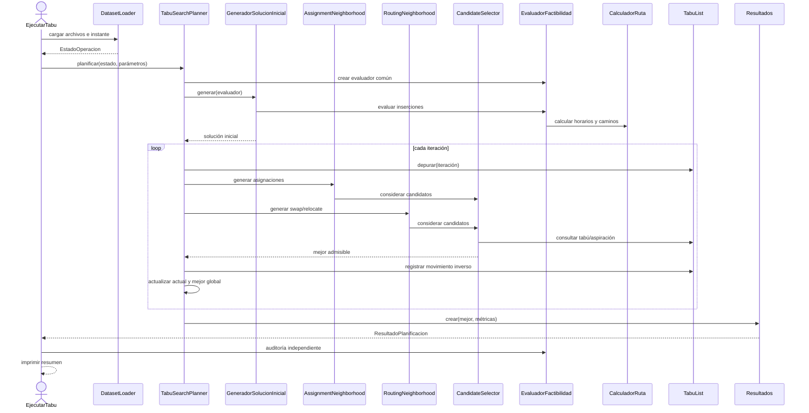
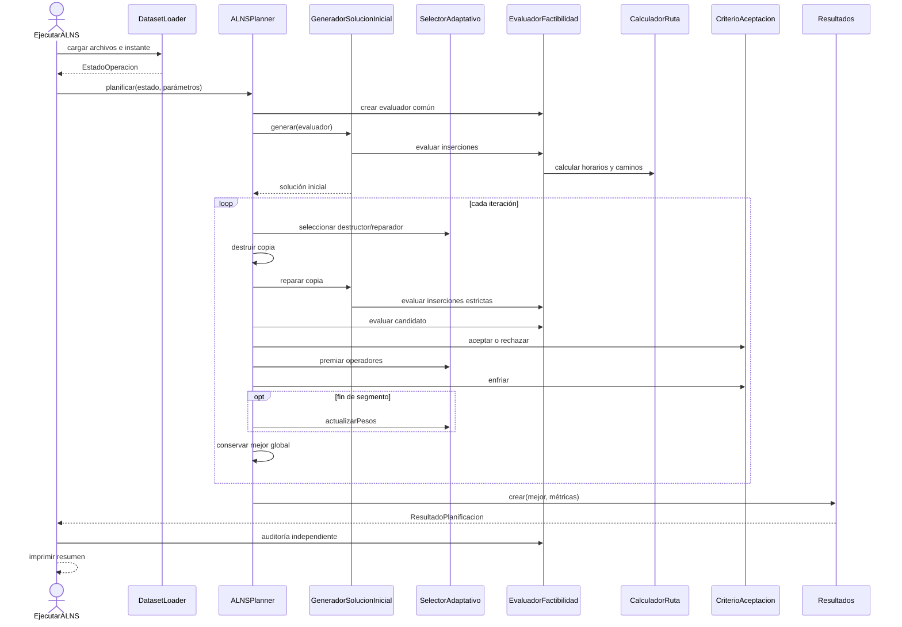

# Arquitectura y ejecución de Tabu Search y ALNS

Este documento describe los motores estrictos empleados en la experimentación. Ambos usan
las mismas entradas, solución inicial, restricciones, rutas y métricas. El ALNS histórico se
conserva únicamente para reproducir resultados anteriores.

## 1. Ejecutar cada algoritmo

Primero compile desde la raíz del repositorio:

    algoritmos\compilar.bat

Los ejecutables reciben:

    ventas.AAAAMM.txt bloqueo.AAMM.txt mantenimiento.txt instante-ISO [iteraciones] [semilla]

Los valores opcionales son 100 iteraciones y semilla 20262.

Tabu Search:

    algoritmos\ejecutar-tabu.bat algoritmos\datos-locales\ventas.202609.txt algoritmos\datos-locales\bloqueo.2609.txt algoritmos\datos-locales\mant.preventivo.09.10.txt 2026-09-01T08:00 100 20262

ALNS estricto:

    algoritmos\ejecutar-alns.bat algoritmos\datos-locales\ventas.202609.txt algoritmos\datos-locales\bloqueo.2609.txt algoritmos\datos-locales\mant.preventivo.09.10.txt 2026-09-01T08:00 100 20262

En Linux/macOS se usan ejecutar-tabu.sh y ejecutar-alns.sh con los mismos argumentos.
Los lanzadores compilan automáticamente si las clases todavía no existen.

También se pueden invocar directamente:

    java -cp algoritmos/out pe.pucp.paqrap.EjecutarTabu <argumentos>
    java -cp algoritmos/out pe.pucp.paqrap.EjecutarALNS <argumentos>

Cada ejecución imprime entrada, semilla, iteraciones, candidatos, Ta, motivo de parada,
cobertura, pendientes, vehículos, utilización, distancia, costo y estos dos estados:

- rutas factibles: las rutas asignadas cumplen todas las restricciones;
- demanda completa: no quedó ninguna cantidad pendiente.

Una salida puede tener rutas factibles y demanda incompleta. En ese caso el motor produjo
un plan válido para parte de la demanda, pero no resolvió todos los pedidos.

## 2. Estructura del código

    algoritmos/
    ├── comun/.../estricto/
    │   ├── modelo/       Estado, parámetros, solución, rutas y resultados
    │   ├── datos/        Cargadores y parsers de TXT
    │   ├── caminos/      Retícula, bloqueos temporales y caminos
    │   └── servicios/    Capacidad, disponibilidad, factibilidad y solución inicial
    ├── tabu/.../tabu/    Motor TS, vecindarios, memoria tabú y aspiración
    ├── alns/.../estricto Motor ALNS y configuración adaptativa
    └── experimentacion/  Ejecutables y comparación

La dependencia es:

    experimentacion → tabu ─┐
                            ├→ comun/estricto
    experimentacion → alns ─┘

El núcleo común no importa ninguna metaheurística.

## 3. Clases y estructuras comunes

| Clase | Responsabilidad |
|---|---|
| DatasetLoader | Lee TXT, valida el período, filtra el snapshot y crea EstadoOperacion |
| EstadoOperacion | Snapshot inmutable con instante, pedidos, flota, almacenes, incidencias y rutas en curso |
| ParametrosOperacion | Servicio, plazos, turnos, descanso, partes, costos y velocidades comunes |
| Pedido / PartePedido | Demanda pendiente y fracciones estables que pueden ir a distintas unidades |
| Vehiculo / TipoVehiculo | Posición, disponibilidad, capacidad, velocidad y tarifa |
| Almacen | Nodo y stock disponible |
| Bloqueo | Intervalo y calles cerradas |
| Averia / Mantenimiento | Intervalos de indisponibilidad |
| Ruta | Vehículo, almacén de origen, partes ordenadas y estado en curso |
| Solucion | Rutas y partes pendientes |
| ResultadoRuta | Horarios, descanso, retorno, caminos, distancia, costo y errores |
| EvaluacionSolucion | Factibilidad, objetivo y paquetes pendientes |
| MetricasResultado | Ta, costos, cobertura, uso de flota, iteraciones y candidatos |
| ResultadoPlanificacion | Solución, evaluación y métricas finales |

## 4. Servicios y métodos comunes

| Clase / método | Función |
|---|---|
| GestorCapacidad.dividir | Divide pedidos sin perder cantidad y conserva partes en curso |
| GestorDisponibilidad.disponible | Comprueba estado, averías y mantenimiento durante toda la ruta |
| GridMap.proximaSalida | Calcula cuándo puede cruzarse una calle sin solapar un bloqueo |
| PathFinder.buscar | Obtiene el camino temporal de llegada mínima y permite esperar |
| CalculadorRuta.calcular | Calcula servicio, descanso, turno, retorno, distancia y costo |
| EvaluadorFactibilidad.evaluar | Valida integridad, stock, capacidad, plazos y disponibilidad |
| GeneradorSolucionInicial.generar | Produce la misma solución inicial para los dos motores |
| GeneradorSolucionInicial.reparar | Prueba almacén, vehículo y posición para partes pendientes |
| Resultados.crear | Audita la mejor solución y genera métricas homogéneas |
| PlanificadorEstricto.planificar | Contrato común implementado por TS y ALNS |

## 5. Tabu Search

| Clase | Función |
|---|---|
| TabuSearchPlanner | Controla iteraciones, mejor global y criterios de parada |
| ConfiguracionTabu | Iteraciones, tenencia, estancamiento, candidatos, tiempo y semilla |
| AssignmentNeighborhood | Inserta pendientes, transfiere partes o las retira de una ruta |
| RoutingNeighborhood | Genera swap y relocate dentro de una ruta |
| Candidato | Une una solución vecina con el movimiento que la produjo |
| TabuMove | Modela asignación, swap o relocate y su clave inversa |
| TabuList | Registra y expira movimientos inversos |
| CandidateSelector | Aplica factibilidad, tabú, aspiración y selección por costo |

TabuSearchPlanner.planificar crea el evaluador y la solución inicial. En cada iteración
elimina expiraciones, alterna vecindarios, evalúa el presupuesto de candidatos, elige el
mejor admisible y registra el movimiento inverso.

AssignmentNeighborhood.generar crea movimientos pendiente→ruta, ruta→ruta y
ruta→pendientes. RoutingNeighborhood.generar crea swap y relocate. Ambos construyen
listas nuevas y no modifican la solución actual.

CandidateSelector.considerar descarta primero los vecinos inviables. Un movimiento tabú
solo pasa por aspiración si mejora estrictamente el mejor objetivo global.
TabuList.registrar prohíbe el movimiento inverso durante la tenencia configurada.

### Diagrama de secuencia de Tabu Search

## 6. ALNS estricto

| Clase | Función |
|---|---|
| ALNSPlanner | Controla destrucción, reparación, aceptación y mejor global |
| ConfiguracionALNS | Iteraciones, destrucción, segmento, reacción, tiempo y semilla |
| SelectorAdaptativo | Selecciona operadores por ruleta y actualiza sus pesos |
| CriterioAceptacion | Acepta mejoras y algunos empeoramientos factibles por temperatura |

ALNSPlanner.planificar parte del constructor común. Selecciona destrucción aleatoria o
relacionada por distancia, retira hasta destruccionMax partes y repara por plazo o en
orden aleatorio. Las rutas en curso no se destruyen.

SelectorAdaptativo.seleccionar usa los pesos de la ruleta. premiar acumula desempeño y
actualizarPesos reajusta los pesos por segmento. CriterioAceptacion.aceptar recibe solo
candidatos que ya pasaron la factibilidad; enfriar reduce la temperatura en cada iteración.

### Diagrama de secuencia de ALNS

## 7. Flujo de factibilidad compartido

```mermaid
flowchart LR
    S[Solución candidata] --> I[Integridad de partes]
    I --> C[Capacidad y stock]
    C --> R[Calcular rutas]
    R --> P[Plazos y servicio]
    P --> T[Turno y descanso]
    T --> D[Averías y mantenimiento]
    D --> B[Caminos con bloqueos]
    B --> O[Retorno a almacén]
    O --> M[Objetivo y métricas]
```

Una parte que no supera la cadena permanece en Solucion.pendientes. El objetivo penaliza
esa cantidad y las métricas muestran la cobertura por pedidos y paquetes.

## 8. Configuración de los lanzadores

| Parámetro | Tabu Search | ALNS |
|---|---:|---:|
| Iteraciones | Argumento; 100 por defecto | Argumento; 100 por defecto |
| Semilla | Argumento; 20262 por defecto | Argumento; 20262 por defecto |
| Estancamiento | Igual a iteraciones | Igual a iteraciones |
| Candidatos | 400 por iteración | Se contabilizan evaluaciones de reparación |
| Tenencia | 7 | No aplica |
| Destrucción máxima | No aplica | 4 partes |
| Segmento | No aplica | 5 iteraciones |
| Reacción | No aplica | 0.7 |
| Aceptación inicial | No aplica | 0.05 |
| Parada por tiempo | Desactivada | Desactivada |

La parada por tiempo está desactivada para reproducibilidad. Igual número de iteraciones
no significa igual trabajo: el resumen también informa los candidatos evaluados.

## 9. Documentos relacionados

- [Diseño detallado de Tabu Search](tabu/DISENO-ALGORITMOS.md).
- [Diseño de ALNS estricto](alns/DISENO-ESTRICTO.md).
- [Verificación de requisitos](VERIFICACION-TABU.md).
- [Experimentación comparativa](experimentacion/COMPARACION-ESTRICTA.md).
