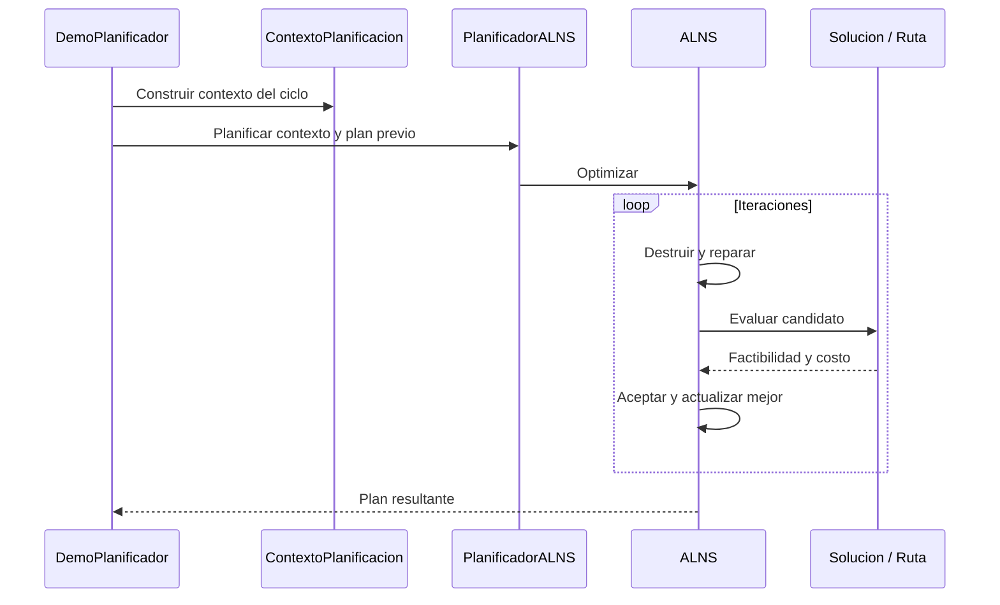

# ALNS consolidado

Motor conservado de `algorithms` (`50f317c`), sin cambios en sus fuentes Java. Requiere JDK 17 para la construcción integrada. Los comandos completos están en la [guía de ejecución](../README.md).

## Ejecución independiente

Desde la raíz del repositorio:

```bat
algoritmos\compilar.bat -Algoritmo alns -Pruebas
algoritmos\ejecutar-alns.bat algoritmos/alns/data/ventas.v20260909/ventas.202601.txt algoritmos/alns/data/bloqueos.v20260909/bloqueo.2601.txt algoritmos/alns/data/mant.preventivo.09.10.txt --dia 1 --hora 1 --ciclos 3 --iteraciones 20 --semilla 20262
```

Equivalente Java: `java -cp algoritmos/alns/out pe.pucp.paqrap.DemoPlanificador <ventas> <bloqueos> <mantenimiento> [opciones]`.

| Opción | Significado / valor predeterminado de la demo |
| --- | --- |
| `--dia`, `--hora` | Instante inicial; día 1, hora 7 |
| `--ciclos` | Cantidad de ciclos; 8 |
| `--sa`, `--k` | Salto en minutos y factor; 10 y 7; Sc=70 minutos |
| `--iteraciones` | Límite por llamada; 1000 |
| `--semilla` | Secuencia aleatoria; 20262 |
| `--anio`, `--mes` | Sobrescriben el periodo deducido de ventas.AAAAMM.txt |
| `--traza` | Activa la traza de búsqueda |

El script mensual `alns/simular.bat` aplica sus propios valores (300 iteraciones y 4464 ciclos por defecto). La consola de la demo muestra los ciclos y un resumen final; el script mensual conserva la salida en `alns/resultados`. Si la inicial es inviable, puede finalizar por colapso sin ejecutar la búsqueda. Una prueba que valida este comportamiento no prueba que todos los pedidos sean imposibles de atender.

## Clases y funcionamiento

| Componente | Función |
| --- | --- |
| `DemoPlanificador` | Lee opciones, construye el contexto, avanza ciclos y presenta resultados |
| `Instancia` | Carga ventas, bloqueos y mantenimiento; crea flota y almacenes |
| `ContextoPlanificacion` | Estado y selección de pedidos para la planificación ALNS |
| `PlanificadorALNS` | Entrada al motor y reoptimización del plan previo |
| `ConstructorInicial.construir` | Inserción inicial ordenada por plazo |
| `ALNS` | Selección adaptativa, destrucción, reparación y aceptación |
| `EvaluadorInsercion` | Busca posiciones de inserción factibles |
| `Solucion.evaluar`, `Ruta` | Evaluación global, inventario y recorrido de cada vehículo |
| `MapaUrbano` | Caminos temporales con bloqueos |
| `PruebaPlanificador` | Verifica factibilidad, operadores, reproducibilidad e integridad |

La cartera incluye 5 destrucciones (aleatoria, peor costo, relacionada, bloqueo y avería) y 2 reparaciones (voraz y arrepentimiento). Los pesos se actualizan por segmentos y la temperatura controla la aceptación de candidatos peores.



El arnés ejecuta rutas completas entre ciclos: no es una simulación detallada de eventos. El motor conserva Sa/K/Sc en su configuración y reglas propias, incluida la opción de no limitar el retorno al fin de turno por defecto. Consultar las [diferencias y metadatos](../METADATOS-PRUEBAS.md) antes de comparar con TS.
