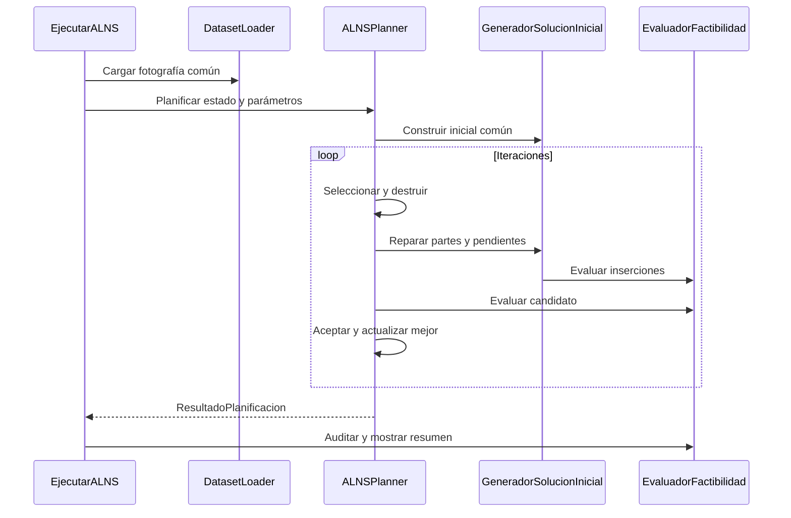

# ALNS comparable

El lanzador principal `algoritmos/ejecutar-alns.bat` ejecuta `EjecutarALNS` sobre el mismo núcleo estricto que TS. Comandos en la [guía común](../README.md).

## Funcionamiento

`ALNSPlanner.planificar` recibe EstadoOperacion y ParametrosOperacion. Construye la misma solución inicial que TS; selecciona destrucción aleatoria o por cercanía y repara mediante inserción común, ordenada por plazo o aleatoria. Compara usando el objetivo del evaluador compartido y conserva la mejor solución.

Reutiliza `SelectorAdaptativo` y `CriterioAceptacion` del ALNS original. La temperatura se escala con costo operativo, excluyendo la penalización por pendientes. El contrato experimental no recibe Sa/K/Sc. La clase histórica ParametrosALNS se usa internamente únicamente como soporte del criterio de aceptación.

## Ejecución y reporte

```bat
algoritmos\compilar.bat -Pruebas
algoritmos\ejecutar-alns.bat algoritmos/alns/data/ventas.v20260909/ventas.202609.txt algoritmos/alns/data/bloqueos.v20260909/bloqueo.2609.txt algoritmos/alns/data/mant.preventivo.09.10.txt 2026-09-01T08:00 20 20262
```

Argumentos opcionales finales: iteraciones, semilla, presupuesto-ms. Se imprime cobertura, pendientes, costo, km, tiempo y factibilidad. Para experimentación usar el [comparador](../README.md#experimentación-conjunta).



## Versión histórica

Las fuentes de `src/pe` conservan el ALNS de algorithms con su cartera original de 5 destrucciones y 2 reparaciones. Compilar con `algoritmos/alns/compilar.bat`; `simular.bat` continúa usando `alns/out`. Ese arnés ejecuta rutas completas por ciclo, conserva Sa/K/Sc y su propio evaluador. Sus resultados no pertenecen al experimento común y no deben mezclarse con él.
