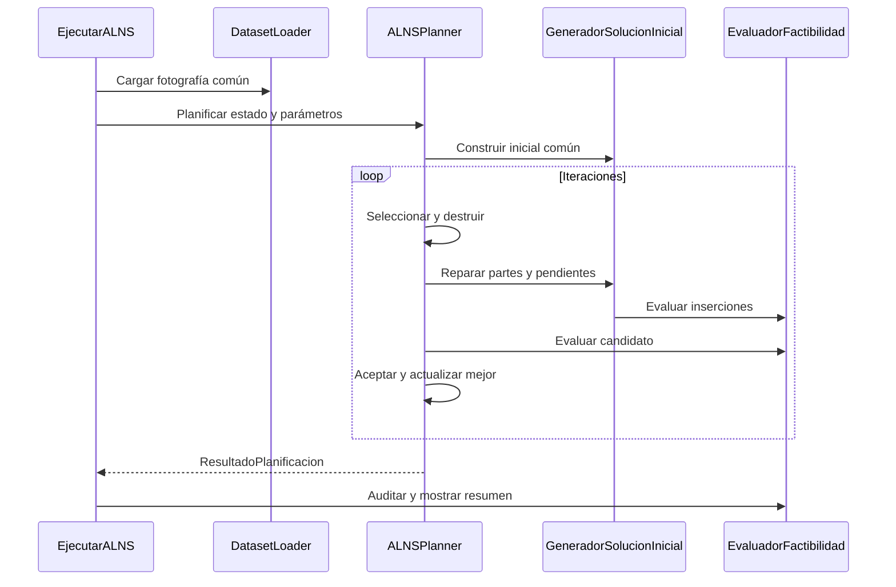

# ALNS comparable

El lanzador principal `algoritmos/ejecutar-alns.bat` ejecuta `EjecutarALNS` sobre el mismo núcleo estricto que TS. Comandos en la [guía común](../README.md).

## Funcionamiento

`ALNSPlanner.planificar` recibe EstadoOperacion y ParametrosOperacion. Construye la misma solución inicial que TS; selecciona destrucción aleatoria o por cercanía y repara mediante inserción común, ordenada por plazo o aleatoria. Compara usando el objetivo del evaluador compartido y conserva la mejor solución.

Reutiliza `SelectorAdaptativo` y `CriterioAceptacion` del ALNS original. El objetivo prioriza completitud y luego holgura; la temperatura inicial es 0.05 en unidades de este objetivo. El contrato experimental no recibe Sa/K/Sc. La clase histórica ParametrosALNS se usa internamente únicamente como soporte del criterio de aceptación.

## Ejecución y reporte

```bat
algoritmos\compilar.bat -Pruebas
algoritmos\ejecutar-alns.bat algoritmos/alns/data/ventas.v20260909/ventas.202609.txt algoritmos/alns/data/bloqueos.v20260909/bloqueo.2609.txt algoritmos/alns/data/mant.preventivo.09.10.txt 2026-09-01T08:00 20 20262
```

Argumentos opcionales finales: iteraciones, semilla, presupuesto-ms y opciones experimentales. Se imprime Ta, holgura promedio/minima, completitud o colapso, cobertura, costo, km y utilizacion. Cada ejecucion exporta CSV; ver [guia comun](../README.md).



## Versión histórica

Las fuentes de `src/pe` conservan el ALNS de algorithms con su cartera original de 5 destrucciones y 2 reparaciones. Compilar con `algoritmos/alns/compilar.bat`; `simular.bat` continúa usando `alns/out`. Ese arnés ejecuta rutas completas por ciclo, conserva Sa/K/Sc y su propio evaluador. Sus resultados no pertenecen al experimento común y no deben mezclarse con él.

### Simulación histórica hasta el colapso

Esta simulación corresponde al ALNS histórico de `src/pe`; es independiente del núcleo estricto comparable descrito arriba.

Todos los comandos se ejecutan desde `algoritmos/alns`, después de `compilar.bat`.

**Simulación hasta el colapso** (escenario de la experimentación numérica). Arranca en el mes
indicado y encadena los meses siguientes de `data/` sin límite de ciclos, hasta que un pedido no
pueda entregarse a tiempo o se acaben los archivos de ventas. La salida queda en
`resultados/colapso_AAAAMM.txt` y cada corrida agrega una fila a
`resultados/experimentos_colapso.csv`:

```bat
colapso.bat 202601
colapso.bat 202601 --iteraciones 1000 --semilla 7
```

Por defecto usa `--dia 1 --hora 0 --sa 10 --k 7 --iteraciones 300`. En Linux / macOS:

```bash
mkdir -p resultados
java -cp out pe.pucp.paqrap.DemoPlanificador data/ventas.v20260909/ventas.202601.txt \
     data/bloqueos.v20260909/bloqueo.2601.txt data/mant.preventivo.09.10.txt \
     --colapso --dia 1 --hora 0 --iteraciones 300 --csv-resumen resultados/experimentos_colapso.csv \
     > resultados/colapso_202601.txt
```

El resumen final reporta el instante del colapso y su causa, los días simulados, el **tiempo real**
de la corrida y el tiempo acumulado del planificador (Σ Ta, promedio y máximo por ejecución), la
**holgura promedio de entrega** (`holgura_promedio_min`), los pedidos registrados, entregados y
fraccionados, y los km y el costo de las rutas despachadas.
Durante la corrida se imprime una línea por día simulado (`--detalle` imprime una por ciclo).

**Campaña de N corridas para la experimentación numérica**: `./experimentos_colapso.sh N`
(Linux, en paralelo) o `experimentos_colapso.bat N` (Windows) ejecuta N semillas hasta el colapso
y deja un CSV por corrida; el análisis estadístico (prueba de hipótesis en R) está en
[`../experimentacion`](../experimentacion/README.md).

**Simular un mes completo** (o hasta el colapso, si ocurre antes). La salida queda en
`resultados/sim_AAAAMM.txt` y al final se muestra el resumen:

```bat
simular.bat 202609
```

Por defecto usa `--dia 1 --hora 0 --ciclos 4464 --sa 10 --k 7 --iteraciones 300`. Cualquier opción
adicional reemplaza a la de por defecto, por ejemplo `simular.bat 202609 --iteraciones 1000 --k 12`.

**Comando equivalente sin el script:**

```bat
java -Dfile.encoding=UTF-8 -cp out pe.pucp.paqrap.DemoPlanificador data\ventas.v20260909\ventas.202609.txt data\bloqueos.v20260909\bloqueo.2609.txt data\mant.preventivo.09.10.txt --dia 1 --hora 0 --ciclos 4464 --sa 10 --k 7 --iteraciones 300 > sim_202609.txt
```

Opciones de `DemoPlanificador`: `--colapso` (sin límite de ciclos, configuración de colapso de
ALNS), `--dia N`, `--hora N`, `--ciclos N`, `--sa MIN` (Sa), `--k N` (K), `--iteraciones N`,
`--semilla N`, `--anio AAAA`, `--mes MM` (por defecto se deducen del nombre del archivo de ventas),
`--detalle`, `--traza`, `--csv-ciclos archivo` (una fila por ciclo), `--csv-resumen archivo`
(agrega una fila por corrida), `--max-viajes N` (viajes por ruta, 3), `--sin-recargas`,
`--holgura-reprogramacion MIN` (240) y `--sin-reprogramacion`. Cuando un pedido no puede entregarse a tiempo, reporta
`COLAPSO LOGÍSTICO` y se detiene.

### Modelo de simulación

- **Reloj discreto**: el planificador se ejecuta cada Sa minutos sobre la cantidad aún no
  despachada de los pedidos de la ventana (pendientes más los registrados en `(T, T+Sc]`).
- **Rutas con recarga** (enunciado del curso, pregunta 10): una unidad lleva varios pedidos en
  cada viaje y, cuando el siguiente pedido ya no cabe, vuelve al almacén más cercano con stock,
  recarga y sigue repartiendo; hasta `--max-viajes` viajes por ruta (3 por defecto).
- **Reprogramación**: un pedido con holgura mayor a `--holgura-reprogramacion` (240 min) puede
  quedar para un ciclo posterior si así se cumple con pedidos más urgentes; cada paquete
  reprogramado penaliza el costo, así que solo se reprograma cuando no cabe ahora.
- **Plan inicial**: cada ciclo construye el plan heredado (retiene los pedidos del plan vigente
  que aún no salieron y los reevalúa con los nuevos) y uno desde cero, y ALNS parte del mejor.
- **Despacho progresivo por viaje**: en cada ciclo solo se despachan los viajes que salen antes
  del ciclo siguiente; el resto del plan se replanifica con la información nueva. Una unidad
  despachada queda comprometida hasta que llega al almacén donde termina su viaje.
- **Entregas**: un pedido se marca como entregado solo cuando el reloj alcanza la llegada de su
  última parte.
- **Pedidos fraccionados**: si ninguna unidad admite un pedido completo, se reparte entre varias.
  Todas las fracciones conservan el registro, el destino y la hora límite del pedido; cada una
  debe llegar antes de esa hora y el pedido cuenta como entregado cuando llega la última.
- **Pendientes en el punto de inicio**: los pedidos registrados antes del arranque cuyo plazo aún
  no venció se mantienen y se planifican desde el primer ciclo, incluidos los del mes anterior
  (se lee su archivo). Los que vencieron antes del arranque quedan fuera del periodo simulado.
- **Pendientes al cambio de mes**: los pedidos no entregados y las rutas en curso continúan en el
  mes siguiente; no hay corte entre meses.
- **Meses encadenados**: cuando la ventana se acerca al fin del último mes cargado, se cargan las
  ventas y los bloqueos del mes siguiente (`ventas.AAAAMM.txt`, `bloqueo.AAMM.txt` en las mismas
  carpetas).
- **Colapso**: un pedido que ya no puede reprogramarse no cabe en ningún plan factible, una
  entrega llega tarde o vence el plazo de un pedido sin despachar. Al colapsar se imprime un
  **diagnóstico** (demanda frente a capacidad, pedido aislado, prueba sin bloqueos, replanificación
  desde cero, mantenimiento) y su resumen queda en la columna `diagnostico_colapso` del CSV.
- `--sin-recargas` y `--sin-reprogramacion` reproducen el modelo anterior (un viaje por ruta y
  todo pedido de la ventana asignado en el plan), para comparar.

### Validación de las recargas y la reprogramación

Prueba del 2026-09-23 (semilla 1, 300 iteraciones, Sa=10, K=7), arrancando el 2026-12-01 00:00 y
encadenando meses. Logs en `resultados/pruebas/`.

| Modelo | Resultado | Ta promedio |
|---|---|---|
| Anterior (`--sin-recargas --sin-reprogramacion`) | Colapso el 2027-01-05 12:30 (un viaje por unidad: la ventana pedía 413 paquetes y la flota lleva 408 por viaje) | ~50 ms |
| Recargas (máx. 3 viajes) + reprogramación + plan inicial desde cero | **Sin colapso hasta el 2027-02-08** (último día completo; 12 101 pedidos entregados, todo enero sin atrasos) | ~150–1000 ms según la carga |

La corrida del modelo nuevo **se detuvo manualmente** por tiempo de cómputo: **solo se probó hasta
el 2027-02-08**, así que no se sabe todavía cuándo colapsa. La campaña de 6 semillas de
`resultados/experimentos/alns` corresponde al modelo anterior.

**Verificación.** Comprueba factibilidad, que ALNS no empeora la solución inicial, las métricas de
candidatos, la cartera de operadores (5 + 2), reproducibilidad, integridad, capacidad, plazos e
inventario en un instante dado:

```bat
java -Dfile.encoding=UTF-8 -cp out pe.pucp.paqrap.PruebaPlanificador data\ventas.v20260909\ventas.202601.txt data\bloqueos.v20260909\bloqueo.2601.txt --dia 3 --hora 10 --iteraciones 500
```

En Windows, `-Dfile.encoding=UTF-8` evita que los acentos salgan como `?` en la consola.

---

## Estructura del código

```
src/pe/pucp/paqrap/
├── modelo/          Dominio: Coordenada, TipoVehiculo, Vehiculo, Almacen, Pedido,
│                    Bloqueo, Averia, Mantenimiento, Turnos
├── mapa/            MapaUrbano: retícula 71×51 y CAMINO_MÁS_RÁPIDO (Dijkstra temporal)
├── datos/           Lectores de ventas, bloqueos y mantenimiento; Instancia
├── solucion/        Ruta (restricciones duras por ruta) y Solucion (EVALUAR y costo)
├── planificador/    Planificador (interfaz), PlanificadorALNS, ContextoPlanificacion,
│                    ParametrosPlanificador
├── simulacion/      Simulador (reloj, despacho, entregas, meses encadenados, colapso),
│                    ParametrosSimulacion, ResultadoSimulacion, FuentesDeDatos
├── alns/            ALNS, ConstructorInicial, EvaluadorInsercion,
│                    SelectorAdaptativo, CriterioAceptacion, ParametrosALNS
│   ├── destruccion/ 5 operadores (2 propios del dominio)
│   └── reparacion/  2 operadores (voraz y arrepentimiento)
├── DemoPlanificador.java
└── PruebaPlanificador.java
```

La interfaz `Planificador` es el punto de extensión que permite intercambiar ALNS y Búsqueda Tabú
sobre el mismo contexto de planificación.

---

## Formato de los archivos de entrada

| Archivo | Formato de línea | Ejemplo |
|---|---|---|
| Ventas | `DDdHHhMMm:x,y,cCCCC,cantidad,plazo` | `01d01h30m:56,30,c4910,02,36` |
| Bloqueos | `DDdHHhMMm-DDdHHhMMm:x1,y1,x2,y2,...` | `01d02h22m-01d04h42m:25,45,45,45,45,40` |
| Mantenimiento | `AAAAMMDD:TXNN` | `20260901:TA01` |

El plazo se expresa en horas: 36 para la modalidad regular, 4/8/12/18 para la priorizada. En el
archivo de bloqueos, cada par consecutivo de vértices define un tramo cerrado en ambos sentidos.
Los códigos de unidad usan el prefijo `TA` para autos, `TM` para motos y `TB` para bicicletas.

## Configuración por defecto

Flota de 10 autos, 15 motos y 12 bicicletas (los códigos que aparecen en el archivo de
mantenimiento preventivo). Almacén central en (25, 15) con inventario ilimitado; intermedios en
(12, 38) y (55, 27) con 1 000 unidades. Todo es configurable por parámetro sin recompilar:
`Instancia.construir`, `ParametrosPlanificador` y `ParametrosALNS` (ConfiguracionALNS del ISA).
