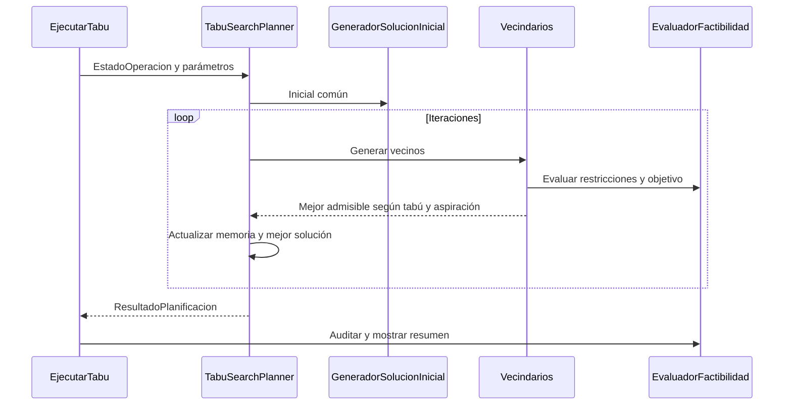

# Tabu Search comparable

El motor de dev/yaser utiliza ahora el mismo núcleo que el ALNS experimental: EstadoOperacion, parámetros, constructor inicial, evaluación y caminos. La lógica de búsqueda TS se conserva.

## Ejecución

Desde la raíz del repositorio:

```bat
algoritmos\compilar.bat -Pruebas
algoritmos\ejecutar-tabu.bat algoritmos/alns/data/ventas.v20260909/ventas.202609.txt algoritmos/alns/data/bloqueos.v20260909/bloqueo.2609.txt algoritmos/alns/data/mant.preventivo.09.10.txt 2026-09-01T08:00 20 20262
```

Utiliza `algoritmos/out`. Argumentos opcionales: iteraciones (100), semilla (20262), presupuesto-ms (0). El reporte final presenta cobertura, pendientes, distancia, costo, utilización, objetivo, tiempo y parada. No utiliza Maven.

## Clases principales

| Clase | Función |
| --- | --- |
| EjecutarTabu / EjecutorIndividual | Carga, configuración y reporte auditado común |
| DatasetLoader | Selección externa de la fotografía |
| TabuSearchPlanner.planificar | Actual/mejor, iteraciones y parada |
| GeneradorSolucionInicial | Inicial determinista compartida |
| AssignmentNeighborhood | Traslados entre rutas e inserción/retiro de pendientes |
| RoutingNeighborhood | Swap y relocate intra-ruta |
| TabuList / TabuMove | Memoria y movimientos inversos |
| CandidateSelector | Factibilidad y aspiración |
| EvaluadorFactibilidad / CalculadorRuta | Reglas y objetivo compartidos |
| PathFinder | Caminos temporales compartidos |

TS puede avanzar a un vecino peor para explorar, pero siempre devuelve el mejor encontrado. Se conservan partes predefinidas y rutas activas completas; todavía no divide cantidades durante los movimientos.



Consultar [metadatos y reglas](../METADATOS-PRUEBAS.md) y [comandos de comparación](../README.md). La experimentación actual es por fotografía, no por simulación continua mensual.
## Registro de la mejor solución

`iteracionMejor` indica la primera iteración que encontró el mejor objetivo devuelto; vale 0 si se conserva la solución inicial. Se incluye en el resumen de consola y en la columna `iteracion_mejor` de los nuevos CSV del comparador. Con presupuesto temporal desactivado, la misma entrada, configuración y semilla permiten repetir el recorrido.

El objetivo compartido prioriza menos paquetes pendientes y luego mayor holgura promedio por pedido. La salida distingue COMPLETA, COLAPSO_PLANIFICACION y SIN_DEMANDA; holgura N/A si hay pendientes. Cada ejecucion exporta un CSV, con Ta, holguras, distancia, tiempo de rutas, vehiculos y utilizacion. Las opciones --escenario, --carga, --instancia y --salida se describen en la guia comun.
