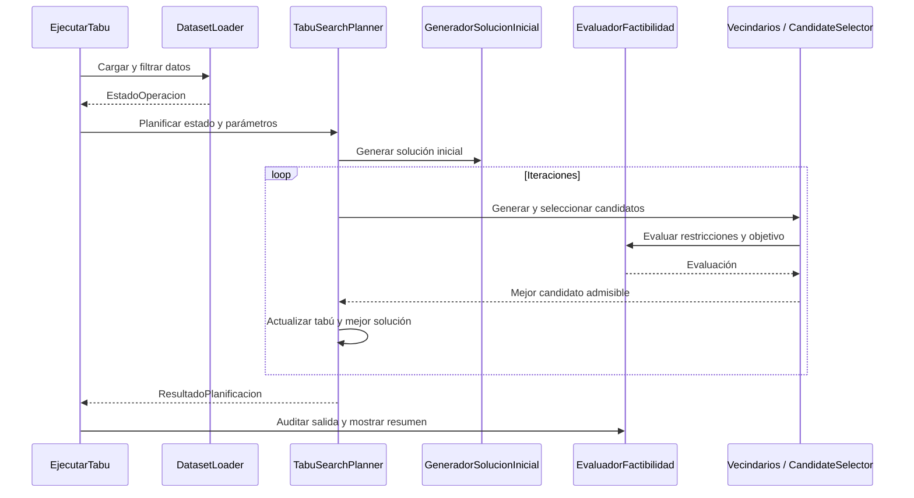

# Tabu Search integrado

Motor y núcleo estricto importados de `dev/yaser` (`6864d6a`). Sustituye al anterior proyecto `pe.logistica`. No utiliza Maven ni JUnit; requiere JDK 17. Sus fuentes del motor no se han modificado en esta integración.

## Ejecución independiente

Desde la raíz del repositorio:

```bat
algoritmos\compilar.bat -Algoritmo tabu -Pruebas
algoritmos\ejecutar-tabu.bat algoritmos/alns/data/ventas.v20260909/ventas.202609.txt algoritmos/alns/data/bloqueos.v20260909/bloqueo.2609.txt algoritmos/alns/data/mant.preventivo.09.10.txt 2026-09-01T08:00 20 20262
```

Equivalente Java: `java -cp algoritmos/tabu/out pe.pucp.paqrap.EjecutarTabu <ventas> <bloqueos> <mantenimiento> <instante-ISO> [iteraciones] [semilla]`.

Los cuatro primeros argumentos son obligatorios. Iteraciones y semilla tienen valores predeterminados 100 y 20262. El lanzador fija tenencia tabú 7, hasta 400 candidatos por iteración, parada por estancamiento igual al límite de iteraciones y presupuesto de reloj desactivado. Para experimentar con otros valores, crear `ConfiguracionTabu` desde Java.

La consola informa cobertura, paquetes pendientes, kilómetros, costo operativo, vehículos, utilización, tiempo, candidatos y parada. `factible=true` no significa demanda completa: las cantidades pendientes se reportan por separado.

## Entrada y filtros efectivos

`EstadoOperacion` contiene instante, pedidos pendientes, vehículos, almacenes, bloqueos, averías, mantenimientos, rutas en curso y vehículos que ya descansaron. `ParametrosOperacion` contiene servicio, turnos, descansos, tamaño de parte, costos y velocidades. Ninguno incluye Sa/K/Sc.

El lanzador de archivos selecciona pedidos registrados hasta el instante dado, con deadline no posterior a las siguientes 24 horas, y como máximo 400. Ordena por plazo y conserva pedidos vencidos; no reconstruye entregas de llamadas anteriores. El CLI no carga averías ni rutas activas; pueden proporcionarse mediante el contrato Java. No es una simulación mensual.

## Clases y funciones

| Componente | Función |
| --- | --- |
| `EjecutarTabu` / `EjecutorIndividual` | Argumentos, configuración, auditoría y resumen |
| `DatasetLoader` | Lee archivos y prepara la fotografía de entrada |
| `TabuSearchPlanner.planificar` | Actual/mejor solución, candidatos, aspiración y parada |
| `GeneradorSolucionInicial.generar` / `reparar` | Constructor por plazo e inserciones factibles |
| `GestorCapacidad.dividir` | Divide demanda en partes predefinidas |
| `AssignmentNeighborhood.generar` | Traslados entre rutas e inserción/retiro de pendientes |
| `RoutingNeighborhood.generar` | Swap y relocate dentro de cada ruta |
| `TabuList` / `TabuMove` | Prohibición temporal de movimientos inversos |
| `CandidateSelector.considerar` | Selecciona candidatos factibles y aplica aspiración |
| `EvaluadorFactibilidad.evaluar` | Conservación de partes, stock y objetivo |
| `CalculadorRuta` / `PathFinder` | Horarios, turnos, descanso, indisponibilidades y caminos |

Las rutas en curso se conservan completas cuando son factibles; el motor no reoptimiza todavía únicamente su sufijo. La demanda pendiente influye mediante una penalización, no mediante el comparador lexicográfico propuesto en el informe. Las partes no se subdividen durante un movimiento.



Las 15 regresiones ejecutables provienen de la suite de `dev/yaser`, adaptada para no depender de otro ALNS. Los detalles de la corrida real y las limitaciones de comparación están en [metadatos y pruebas](../METADATOS-PRUEBAS.md).
